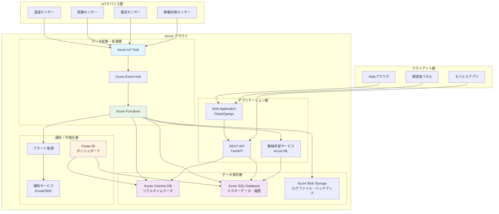
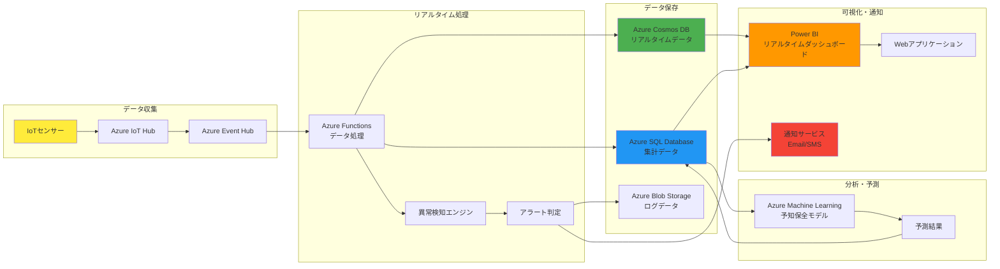
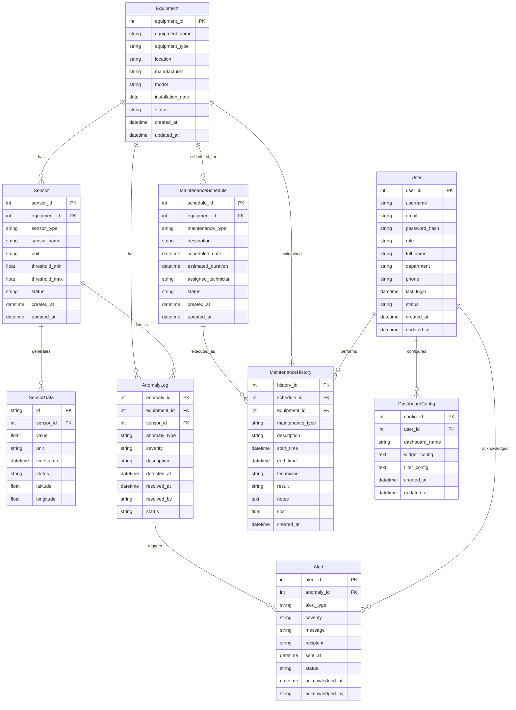
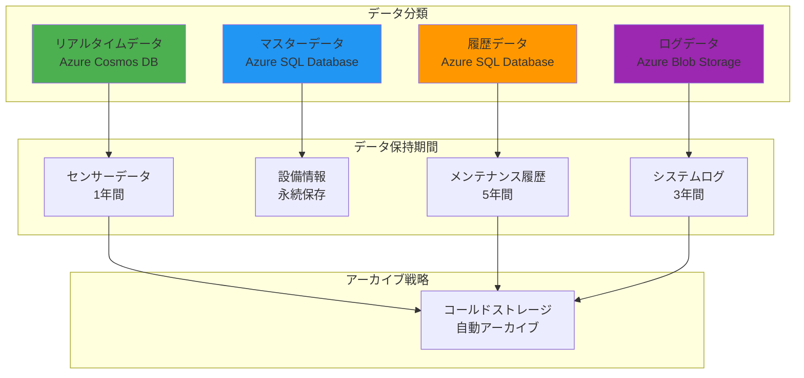
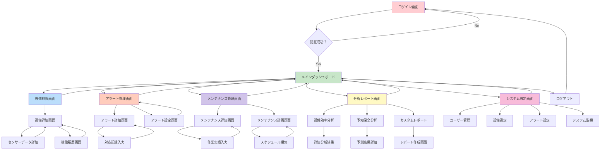
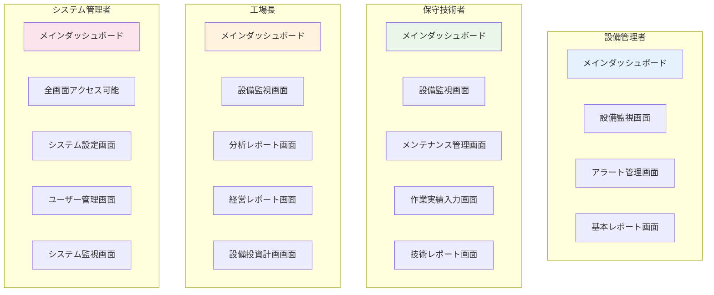
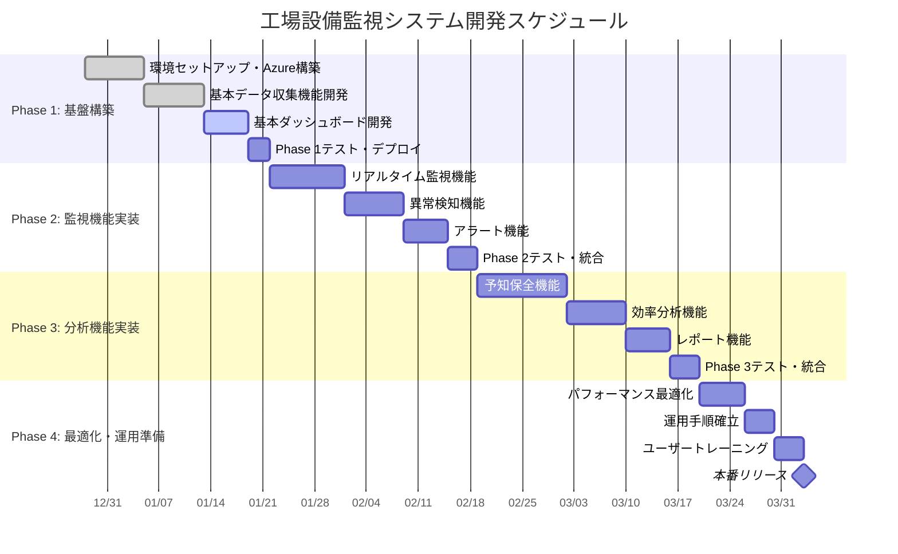
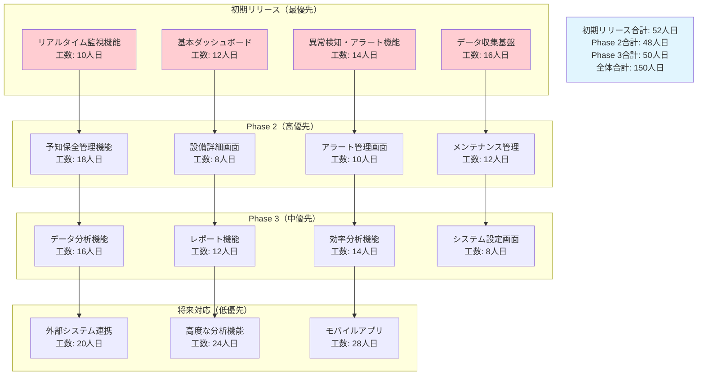
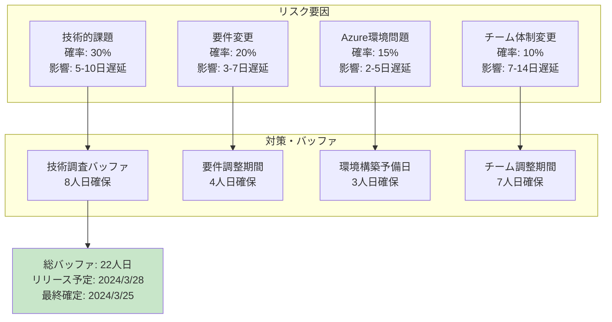

# 工場設備監視システム - 設計資料

## 1. アプリケーションアーキテクチャ

### 1.1 システム全体アーキテクチャ

### 1.2 データフローアーキテクチャ

## 2. データモデル

### 2.1 データベース構造図

### 2.2 データ分類と保存戦略

## 3. 画面遷移図

### 3.1 ユーザー画面遷移図

### 3.2 権限別画面アクセス制御

## 4. プロジェクトマイルストーン

### 4.1 開発期間とリソース計算

**計算根拠:**
- 開発期間: 2023/12/28 ～ 2024/3/28（約3ヶ月 = 90日）
- 開発者: 3名 × 稼働率90% = 2.7人/日
- 土日祝日除外: 90日 × 5/7 = 約64営業日
- 総工数: 64営業日 × 2.7人/日 = 172.8人日

### 4.2 プロジェクトマイルストーン

### 4.3 機能優先度とマイルストーン詳細

### 4.4 リスク管理とバッファ

---

**文書作成日**: 2024年12月19日  
**作成者**: AI-Driven Development Team  
**版数**: 1.0